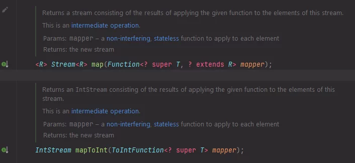
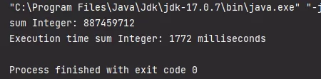
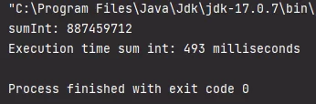
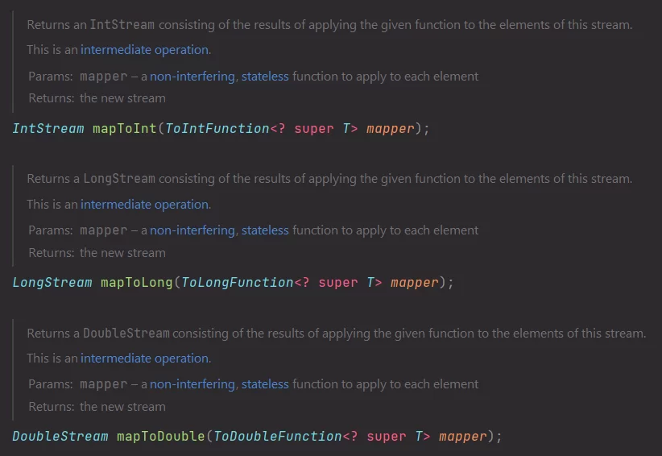

Java's Stream API facilitates code maintenance, is used with lambda expressions and functional paradigm. It offers many features such as filtering a list, among others.

Let's see an example. For this, I created a class called Product.

```
public class Product {

    private String name;
    private int quantity;

    public Product(String name, int quantity) {
        this.name = name;
        this.quantity = quantity;
    }

    public String getName() {
        return name;
    }

    public void setName(String name) {
        this.name = name;
    }

    public int getQuantity() {
        return quantity;
    }

    public void setQuantity(int quantity) {
        this.quantity = quantity;
    }
}
```

I populated a list of products and created the following stream. My goal is to map the quantity, which is a primitive type "int".

```
        Stream<Integer> quantities = products.stream()
                .map(Product::getQuantity);
```

This returns a **_Stream_** because the quantity returns an integer value, which is a primitive type "**_int_**". However, it is not possible to return a **_Stream_** of "_**int**_", so the transformation from **_"int"_** to **"Integer"** (Boxing) occurs.

A Stream with a few elements might have an irrelevant performance loss, but a Stream with many elements can result in significant performance loss.

That's why there's a special type to use for primitive values of type **_"int"_**, which is **_"IntStream"_**. To achieve this, we need to use _**"mapToInt"**_ to return an **_"IntStream"_** since **_"map"_** returns a **_"Stream"_**.

```
        IntStream stream = products.stream()
                .mapToInt(Product::getQuantity);
```

* * *


* * *

I created an empty list of products and added many products to it.

```
List<Product> products = new ArrayList<>();

for (int i = 0; i < 10_000_000_0L; i++) {
            products.add(new Product("Product "+ i, i));
        }
```

Then I tried to sum using the **_"map"_**.

```
        long startTime = System.currentTimeMillis();

        Integer sum = products.stream()
                .map(Product::getQuantity).reduce(0, Integer::sum);
                
        System.out.println("sum Integer: " + sum);

        long endTime = System.currentTimeMillis();
        long duration = endTime - startTime;
        System.out.println("Execution time sum Integer: " + duration + " milliseconds");
```

I had the following result.




* * *

Then I tried to add using _**"mapToInt"**_.

```
        long startTime = System.currentTimeMillis();

        int sum = products.stream()
            .mapToInt(Product::getQuantity).sum();
            
        System.out.println("sumInt: " + sum);

        long endTime = System.currentTimeMillis();
        long duration = endTime - startTime;
        System.out.println("Execution time sum int: " + duration + " milliseconds");
```

* * *



* * *

I was able to notice a difference in execution time using the same list of products, the same computer for both, and the same operating system.

It's interesting to note that there are also other methods available for other **_primitive types_**, such as _**"mapToLong"**_ and _**"mapToDouble"**_.



