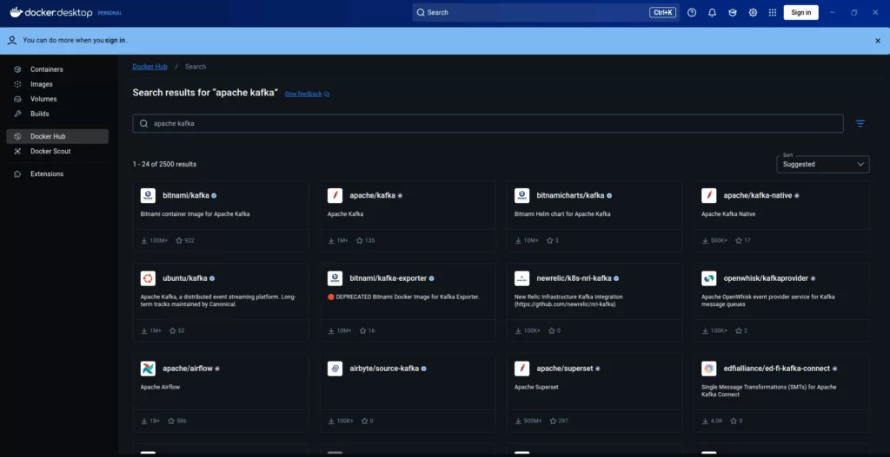
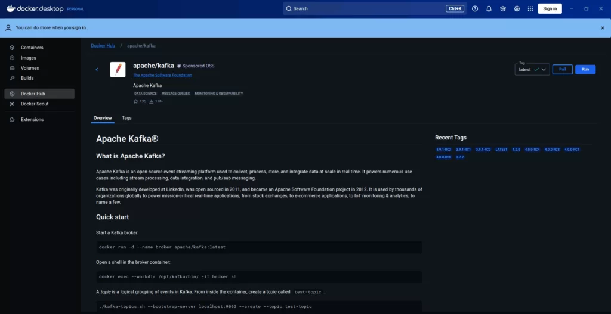
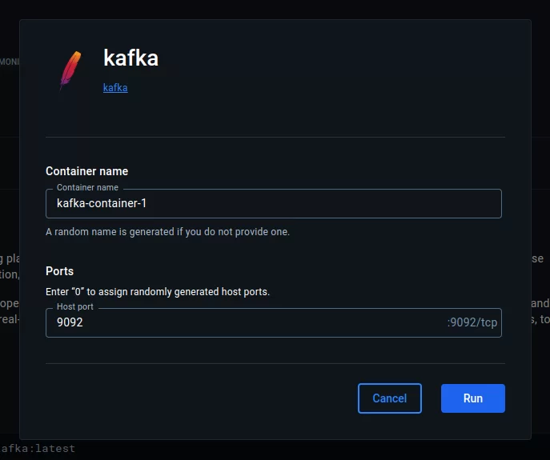
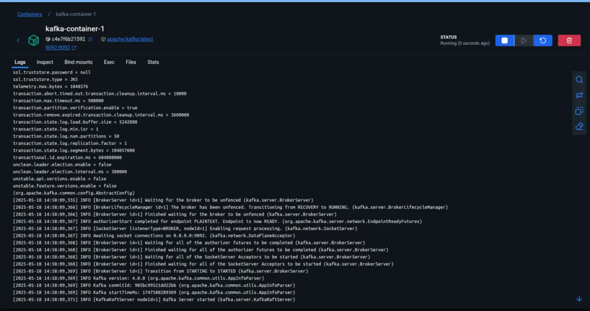
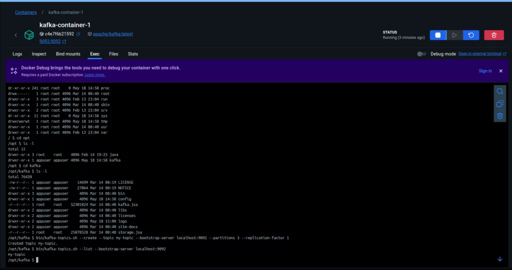

It’s possible to use Kafka on various operating systems, but here we’ll use **Docker on Ubuntu Linux**. We need Docker Desktop installed in order to proceed. You can follow this tutorial to install it:  
👉 [tutorial](https://docs.docker.com/desktop/setup/install/linux/) .

Go to **Docker Hub** and in the search bar, look for **“apache kafka”**. This will allow us to download the image needed to create a container.

Hands on



After clicking on the **Apache Kafka** image, download it by clicking **Pull**, then go to the **Run** option.



Set the **container name** and **port**, then click **Run**.



The log should indicate that everything is running properly.



Now, in the **Exec** tab, we can run commands inside the `/opt/kafka` directory.

```
cd opt
```

```
cd kafka
```

```
bin/kafka-topics.sh --create --topic my-topic --bootstrap-server localhost:9092 --partitions 3 --replication-factor 1
```

This way, we can create a **topic**.

```
bin/kafka-topics.sh --list --bootstrap-server localhost:9092
```

Use the following command to **list topics**.



Conclusion

This is a practical way to run **Kafka locally** without installing it directly on your operating system.
